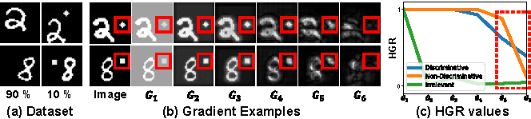
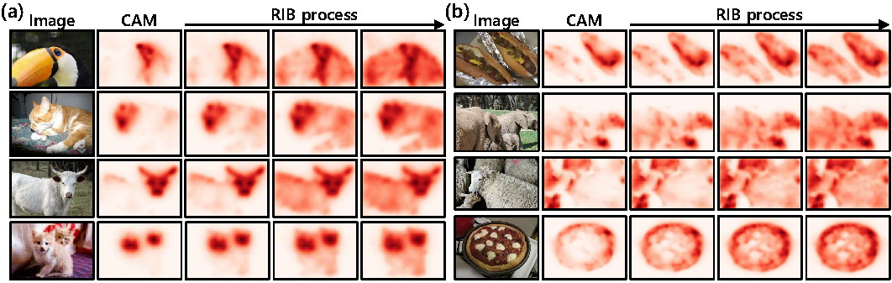

# Reducing Information Bottleneck for Weakly Supervised Semantic Segmentation (NeurIPS 2021)

The implementation of Reducing Infromation Bottleneck for Weakly Supervised Semantic Segmentation, Jungbeom Lee, Jooyoung Choi, Jisoo Mok, and Sungroh Yoon, NeurIPS 2021. [[paper](http://arxiv.org/abs/2110.06530)]


<p align="left"></p>
<p align="left"></p>

## Abstract
Weakly supervised semantic segmentation produces pixel-level localization from class labels; however, a classifier trained on such labels is likely to focus on a small discriminative region of the target object. We interpret this phenomenon using the information bottleneck principle: the final layer of a deep neural network, activated by the sigmoid or softmax activation functions, causes an information bottleneck, and as a result, only a subset of the task-relevant information is passed on to the output. We first support this argument through a simulated toy experiment and then propose a method to reduce the information bottleneck by removing the last activation function. In addition, we introduce a new pooling method that further encourages the transmission of information from non-discriminative regions to the classification. Our experimental evaluations demonstrate that this simple modification significantly improves the quality of localization maps on both the PASCAL VOC 2012 and MS COCO 2014 datasets, exhibiting a new state-of-the-art performance for weakly supervised semantic segmentation.

## Installation

- We kindly refer to the offical implementation of [IRN](https://github.com/jiwoon-ahn/irn).

## Usage

### Step 1. Prepare Dataset

- Download Pascal VOC dataset [here](https://drive.google.com/file/d/1jhtdjj3xrEp60zO3B7jZ14yxxZkCJMeM/view?usp=sharing).
- Download MS COCO images from the official COCO website [here](https://cocodataset.org/#download).
- Download semantic segmentation annotations for the MS COCO dataset [here](https://drive.google.com/file/d/1pRE9SEYkZKVg0Rgz2pi9tg48j7GlinPV/view?usp=sharing).

- Directory hierarchy 
```
    Dataset
    ├── VOC2012_SEG_AUG       # unzip VOC2012_SEG_AUG.zip           
    ├── coco_2017             # mkdir coco_2017
    │   ├── coco_seg_anno     # included in coco_annotations_semantic.zip
    └── └── JPEGImages        # include train and val images downloaded from the official COCO website
```

### Step 2. Prepare pre-trained classifier
- Pre-trained model used in this paper: [Pascal VOC](https://drive.google.com/file/d/1evRxPD4PhcdGySGFXDoOAtOiUVg4oNXk/view?usp=sharing), [MS COCO](https://drive.google.com/file/d/1SDKjPzzuXR4PX_H1l3Kw5NY8d20FmG4X/view?usp=sharing).
- You can also train your own classifiers following [IRN](https://github.com/jiwoon-ahn/irn).

### Step 3. Generate and evaluate the pseudo ground-truth masks for PASCAL VOC and MS COCO
- PASCAL VOC

```
bash get_pseudo_gt_VOC.sh
```

- MS COCO

```
bash get_pseudo_gt_COCO.sh
```

### Step 4. Train a semantic segmentation network
- To train DeepLab-v2, we refer to [deeplab-pytorch](https://github.com/kazuto1011/deeplab-pytorch). However, this repo contains only COCO pre-trained model. We provide [ImageNet pre-trained model](https://drive.google.com/file/d/14soMKDnIZ_crXQTlol9sNHVPozcQQpMn/view?usp=sharing) for a fair comparison with the other methods.


## Acknowledgment
This code is heavily borrowed from [IRN](https://github.com/jiwoon-ahn/irn), thanks [jiwoon-ahn](https://github.com/jiwoon-ahn)!


